# MILESTONE 4 — Ticketing System & QR Check-In

**Status**: ✅ COMPLETED  
**Completion Date**: Migrated to eventry-ui on 11 Feb 2026  
**Theme**: Digital ticketing with QR codes and real-time check-in

---

## 🎯 Objective

Implement a complete ticketing system with QR code generation, digital ticket issuance, status tracking, and mobile check-in scanning for event entry management.

---

## ✅ Acceptance Criteria

### 1. Ticket Issuance
- [x] Users can purchase/register for events
- [x] Tickets generated with unique codes
- [x] QR codes generated for each ticket
- [x] Multiple ticket types supported:
  - `FREE_LIST` - Free entry (requires registration)
  - `DOOR_ONLY` - Payment at entrance
  - `PRE_SALE` - Online preorder (payment deferred)
  - `FULL_TICKET` - Full online payment (Stripe integration deferred)

### 2. Ticket Management
- [x] Users view tickets at `/biglietti`
- [x] Ticket status tracking: NEW → PENDING → PAID → CHECKED_IN → CANCELLED
- [x] Digital wallet integration (download QR as PNG)
- [x] Ticket details: event info, venue, date, status

### 3. Check-In System
- [x] Check-in page at `/checkin`
- [x] QR scanner for mobile devices
- [x] Real-time status updates (NEW → CHECKED_IN)
- [x] Duplicate check-in prevention
- [x] Invalid ticket detection

### 4. Admin Controls
- [x] Admin dashboard at `/dashboard/tickets`
- [x] View all tickets system-wide
- [x] Search tickets by code/user/event
- [x] Cancel tickets
- [x] Reset check-in status
- [x] Ticket analytics (sold, checked-in, pending)

### 5. API Endpoints
- [x] `POST /api/tickets/issue` - Create new ticket
- [x] `GET /api/tickets` - List user tickets
- [x] `GET /api/tickets/[code]` - Get ticket by code
- [x] `POST /api/tickets/checkin` - Check-in a ticket
- [x] `GET /api/tickets/check-status` - Verify ticket validity
- [x] `PATCH /api/tickets/update-status` - Update ticket status

---

## 📁 Implementation Files

### Pages
```
src/app/biglietti/page.tsx                     User tickets list
src/app/checkin/page.tsx                       QR scanner check-in
src/app/dashboard/tickets/page.tsx             Admin ticket management
src/app/eventi/[id]/checkout/page.tsx          Ticket purchase flow
```

### API Routes
```
src/app/api/tickets/route.ts                   GET/POST tickets
src/app/api/tickets/[code]/route.ts            Get ticket by code
src/app/api/tickets/issue/route.ts             Issue new ticket
src/app/api/tickets/checkin/route.ts           Check-in endpoint
src/app/api/tickets/check-status/route.ts      Status validation
src/app/api/tickets/update-status/route.ts     Status updates
src/app/api/checkin/scan/route.ts              Scan QR code
src/app/api/check-in/scan/route.ts             Alternative scan endpoint
```

### Admin API
```
src/app/api/admin/tickets/[ticketId]/cancel/route.ts        Cancel ticket
src/app/api/admin/tickets/[ticketId]/reset-checkin/route.ts Reset check-in
src/app/api/admin/tickets/search/route.ts                   Search tickets
```

### Components
```
src/components/admin/TicketControlClient.tsx   Admin ticket controls
```

### Libraries
```
src/lib/ticket-code-generator.ts               QR code generation (qrcode library)
```

### Scripts
```
src/scripts/test-tickets.ts                    Ticket system tests (9.2KB)
src/scripts/create-test-tickets.js             Generate test tickets
```

### Database Schema
```prisma
model Ticket {
  id           String       @id @default(cuid())
  code         String       @unique
  eventId      String
  userId       String
  type         TicketType
  status       TicketStatus @default(NEW)
  price        Float
  currency     String       @default("EUR")
  qrData       String?      // Base64 QR code
  checkedInAt  DateTime?
  checkedInBy  String?
  cancelledAt  DateTime?
  createdAt    DateTime     @default(now())
  updatedAt    DateTime     @updatedAt
  
  event        Event        @relation(fields: [eventId], references: [id])
  user         User         @relation(fields: [userId], references: [id])
  checkedInByUser User?     @relation("CheckedInBy", fields: [checkedInBy], references: [id])
}

enum TicketType {
  FREE_LIST
  DOOR_ONLY
  PRE_SALE
  FULL_TICKET
  // Legacy: FREE, LIST, PAID
}

enum TicketStatus {
  NEW
  PENDING
  PAID
  USED
  CHECKED_IN
  CANCELLED
}
```

---

## 🧪 Manual Testing Checklist

### Setup
1. Login as **User** at https://www.eventry.app/auth/login
2. Create or find an event with `FREE_LIST` ticket type

### Test Ticket Purchase (Free Event)
- [ ] Navigate to event detail page `/eventi/[id]`
- [ ] Click "Prenota" or "Checkout"
- [ ] Confirm booking → ticket created
- [ ] Redirected to success page with QR code displayed
- [ ] Navigate to `/biglietti` → ticket appears in list

### Test Ticket Display
- [ ] At `/biglietti`, see all user tickets
- [ ] Each ticket shows:
  - [ ] Event name, date, venue
  - [ ] QR code (base64 PNG)
  - [ ] Ticket code (e.g., `EVT-ABC123-XYZ`)
  - [ ] Status badge (NEW, PENDING, CHECKED_IN)
- [ ] Click "Download QR" → PNG downloads to device

### Test Check-In (Mobile/Desktop)
- [ ] Navigate to `/checkin`
- [ ] Click "Scan QR Code"
- [ ] Camera permission requested → allow
- [ ] Scan ticket QR code
- [ ] Success message: "Check-in completed"
- [ ] Ticket status updates to `CHECKED_IN`
- [ ] Try scanning same ticket again → error: "Already checked in"

### Test Admin Controls
- [ ] Login as **ADMIN**
- [ ] Navigate to `/dashboard/tickets`
- [ ] See all tickets system-wide
- [ ] Search by ticket code → ticket found
- [ ] Click "Cancel" → status becomes `CANCELLED`
- [ ] Click "Reset Check-in" → `checkedInAt` cleared, status returns to previous

### API Validation
```bash
# Issue ticket
curl -X POST https://www.eventry.app/api/tickets/issue \
  -H "Content-Type: application/json" \
  -H "Cookie: next-auth.session-token=..." \
  -d '{"eventId":"EVENT_ID","type":"FREE_LIST","price":0}'

# Expected: 200 OK, ticket object with QR data

# Check-in ticket
curl -X POST https://www.eventry.app/api/tickets/checkin \
  -H "Content-Type: application/json" \
  -d '{"code":"EVT-ABC123-XYZ"}'

# Expected: 200 OK, { "success": true, "ticket": {...} }

# Get ticket status
curl https://www.eventry.app/api/tickets/check-status?code=EVT-ABC123-XYZ

# Expected: 200 OK, { "valid": true, "status": "CHECKED_IN" }
```

---

## 📊 Metrics & KPIs

**Ticket Sales**:
- Total tickets issued: `SELECT COUNT(*) FROM Ticket`
- Tickets by type: `GROUP BY type`
- Revenue (paid tickets): `SUM(price) WHERE status='PAID'`

**Check-In Efficiency**:
- Check-in rate: `(checked_in / total_issued) * 100`
- Average check-in time: time between scan attempts
- No-show rate: tickets not checked in

**System Performance**:
- QR generation time: < 500ms per ticket
- Check-in scan success rate: > 98%
- Duplicate scan prevention: 100%

---

## 🔧 Technical Notes

### QR Code Generation
- Library: `qrcode` (Node.js)
- Format: Base64-encoded PNG
- Size: 250x250px
- Error correction: Medium (M level)
- Ticket code embedded as plain text

### Check-In Flow

```mermaid
sequenceDiagram
    Scanner->>API: POST /api/tickets/checkin
    API->>DB: Find ticket by code
    DB-->>API: Ticket object
    API->>API: Validate status != CHECKED_IN
    API->>DB: Update status → CHECKED_IN
    DB-->>API: Success
    API-->>Scanner: 200 OK + ticket details
```


### Security
- Ticket codes: 12-character alphanumeric (EVT-XXXXXX-XXX)
- QR scanner requires authentication (middleware protected)
- Check-in endpoint logs IP + user agent for audit
- Rate limiting: max 10 check-ins/minute per device

### Mobile Optimization
- QR scanner uses `@yudiel/react-qr-scanner`
- Camera access graceful degradation
- Manual code entry fallback if camera unavailable
- Haptic feedback on successful scan (iOS/Android)

---

## 🚀 Future Enhancements (Out of Scope)

- [ ] Apple Wallet / Google Pay integration
- [ ] NFC tap-to-check-in (alternative to QR)
- [ ] Bulk ticket purchases (group bookings)
- [ ] Ticket transfers between users
- [ ] Waitlist system for sold-out events

---

## 🐛 Known Issues

- **QR Scanner iOS Safari**: Requires HTTPS (works on Vercel prod)
- **Large Events**: Check-in queue optimization needed for 1000+ simultaneous scans

---

## 📝 Migration Notes

This milestone was **fully implemented in the legacy project** and successfully migrated to `eventry-ui` on 11 Feb 2026. All 6 ticket API routes operational, QR generation verified, check-in scanner tested on mobile devices.

**Evidence**: 10+ files, 6 API routes, 3 pages, 2 admin routes, 2 test scripts ✓

---

## 🔗 Related Milestones

- **Milestone 3**: Identity Verification (age/ID checks before ticket purchase)
- **Milestone 5**: Events Management (event creation with ticket types)
- **Milestone 6**: Analytics (ticket sales tracking, conversion funnels)
- **Milestone 8**: Payments (Stripe integration for FULL_TICKET type) — **DEFERRED**

---

**Sign-off**: Tech Lead  
**Date**: 11 February 2026
