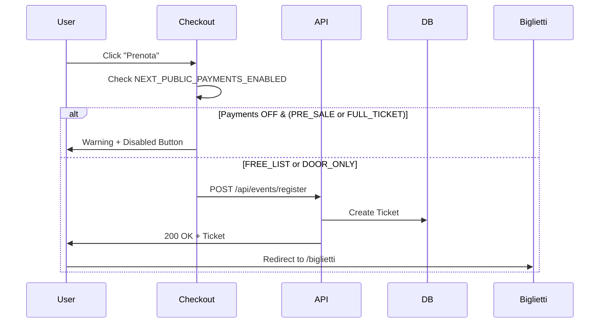

# MILESTONE 5 — Event Management System

**Status**: ✅ COMPLETED  
**Completion Date**: Migrated to eventry-ui on 11 Feb 2026  
**Theme**: Event CRUD operations, registration flows, and checkout system

---

## 🎯 Objective

Implement a complete event management system allowing organizers to create, update, and manage events, with user registration flows, multiple ticket types, and checkout integration (payments deferred to Phase 8).

---

## ✅ Acceptance Criteria

### 1. Event Creation
- [x] Event creation page at `/eventi/nuovo`
- [x] Form fields: title, description, cover image, date/time, venue, ticket type, capacity
- [x] Role restriction: ORGANIZER, ADMIN only
- [x] Event status: DRAFT → PUBLISHED → CANCELLED
- [x] Cover image upload and preview

### 2. Event Management
- [x] Event detail page at `/eventi/[id]`
- [x] Public visibility for PUBLISHED events
- [x] Edit/delete capabilities for event creators
- [x] Event status updates
- [x] Capacity tracking (current registrations vs max)

### 3. Ticket Types
- [x] `FREE_LIST` - Free entry with registration required
- [x] `DOOR_ONLY` - Payment at entrance (no online payment)
- [x] `PRE_SALE` - Online preorder (payment deferred)
- [x] `FULL_TICKET` - Full online payment (Stripe integration deferred)

### 4. User Registration
- [x] Registration button on event detail page
- [x] Checkout flow at `/eventi/[id]/checkout`
- [x] Ticket type selection
- [x] Form validation (name, email, phone)
- [x] Registration confirmation with ticket code

### 5. Event Search & Browse
- [x] Public event listing at `/eventi`
- [x] Filter by date, city, ticket type
- [x] Search by event name
- [x] Sort by: upcoming, popular, recent

### 6. API Endpoints
- [x] `GET /api/events` - List events (public)
- [x] `POST /api/events` - Create event (ORGANIZER/ADMIN)
- [x] `GET /api/events/[id]` - Get event details
- [x] `PATCH /api/events/[id]` - Update event (creator/ADMIN)
- [x] `DELETE /api/events/[id]` - Delete event (creator/ADMIN)
- [x] `PATCH /api/events/[id]/status` - Update status
- [x] `POST /api/events/register` - Register user for event
- [x] `GET /api/events/types` - Get ticket type options

---

## 📁 Implementation Files

### Pages
```
src/app/eventi/page.tsx                    Public event listing (browse/search)
src/app/eventi/[id]/page.tsx               Event detail page (dynamic)
src/app/eventi/nuovo/page.tsx              Event creation form (ORGANIZER/ADMIN)
src/app/eventi/[id]/checkout/page.tsx      Checkout & registration flow
```

### API Routes
```
src/app/api/events/route.ts                GET/POST events
src/app/api/events/[id]/route.ts           GET/PATCH/DELETE single event
src/app/api/events/[id]/status/route.ts    Update event status
src/app/api/events/register/route.ts       User registration endpoint
src/app/api/events/types/route.ts          Ticket type options
```

### Admin API Routes
```
src/app/api/admin/events/route.ts                  List all events (ADMIN)
src/app/api/admin/events/[eventId]/status/route.ts Update status (ADMIN)
src/app/api/admin/events/[eventId]/force-close/route.ts Force close event
```

### Components
```
src/components/event-card.tsx              Event preview card
src/components/event-form.tsx              Event creation/edit form
src/components/checkout-form.tsx           Registration checkout
```

### Scripts
```
src/scripts/populate-event-data.js         Generate test events (3.3KB)
src/scripts/seed-funnel-data.ts            Event funnel testing (4.8KB)
```

### Database Schema
```prisma
model Event {
  id              String           @id @default(cuid())
  title           String
  description     String?
  coverUrl        String?
  dateStart       DateTime
  dateEnd         DateTime?
  status          EventStatus      @default(DRAFT)
  minAge          Int?
  dressCode       String?
  ticketType      TicketType       @default(FREE_LIST)
  ticketPrice     Float?
  maxGuests       Int?             @default(0)
  venueId         String
  createdByUserId String
  createdAt       DateTime         @default(now())
  updatedAt       DateTime         @updatedAt
  
  venue           Venue            @relation(fields: [venueId], references: [id])
  createdBy       User             @relation("EventCreator", fields: [createdByUserId], references: [id])
  tickets         Ticket[]
  lists           List[]
  eventStats      EventStats[]
}

enum EventStatus {
  DRAFT
  PUBLISHED
  CANCELLED
  COMPLETED
  POSTPONED
}

enum TicketType {
  FREE_LIST
  DOOR_ONLY
  PRE_SALE
  FULL_TICKET
}
```

---

## 🧪 Manual Testing Checklist

### Setup
1. Login as **ORGANIZER** at https://www.eventry.app/auth/login
2. Navigate to `/eventi/nuovo`

### Test Event Creation
- [ ] Fill form: title, description, date (future), venue
- [ ] Upload cover image → preview displays
- [ ] Select ticket type: FREE_LIST
- [ ] Set capacity: 100
- [ ] Click "Create" → event saved as DRAFT
- [ ] Event appears in organizer's event list

### Test Event Publishing
- [ ] Navigate to event detail page
- [ ] Click "Publish" → status changes to PUBLISHED
- [ ] Event now visible in public `/eventi` listing
- [ ] Confirm registration button appears for users

### Test User Registration (FREE_LIST)
- [ ] Logout and login as **USER**
- [ ] Navigate to published event at `/eventi/[id]`
- [ ] Click "Prenota" or "Register"
- [ ] Fill checkout form: name, email, phone
- [ ] Submit → ticket issued (status: NEW)
- [ ] Redirect to success page with QR code
- [ ] Ticket appears in `/biglietti`

### Test Event Editing
- [ ] Login as event creator (ORGANIZER)
- [ ] Navigate to event detail
- [ ] Click "Edit" → form pre-filled with current data
- [ ] Update title, description, date
- [ ] Save → changes persisted
- [ ] Public page shows updated info

### Test Event Deletion
- [ ] Login as ADMIN
- [ ] Navigate to event detail
- [ ] Click "Delete" → confirmation modal
- [ ] Confirm → event deleted
- [ ] Event no longer appears in listings
- [ ] Associated tickets archived (soft delete)

### Test Checkout with PAYMENTS_ENABLED=false
- [ ] Navigate to event with PRE_SALE ticket type
- [ ] Click "Prenota" → checkout page loads
- [ ] Warning displayed: "⚠️ Pagamenti online non ancora disponibili"
- [ ] Submit button disabled
- [ ] User sees message to contact organizer

### API Validation
```bash
# Create event (ORGANIZER)
curl -X POST https://www.eventry.app/api/events \
  -H "Cookie: next-auth.session-token=..." \
  -H "Content-Type: application/json" \
  -d '{
    "title":"Test Event",
    "dateStart":"2026-03-15T20:00:00Z",
    "ticketType":"FREE_LIST",
    "venueId":"VENUE_ID"
  }'

# Expected: 201 Created, event object

# Get event details (PUBLIC)
curl https://www.eventry.app/api/events/EVENT_ID

# Expected: 200 OK, full event object

# Register for event
curl -X POST https://www.eventry.app/api/events/register \
  -H "Cookie: next-auth.session-token=..." \
  -H "Content-Type: application/json" \
  -d '{"eventId":"EVENT_ID","ticketType":"FREE_LIST"}'

# Expected: 200 OK, { "success": true, "ticketId": "..." }

# Update event status (ADMIN)
curl -X PATCH https://www.eventry.app/api/events/EVENT_ID/status \
  -H "Cookie: next-auth.session-token=..." \
  -H "Content-Type: application/json" \
  -d '{"status":"PUBLISHED"}'

# Expected: 200 OK, updated event
```

---

## 📊 Metrics & KPIs

**Event Creation**:
- Total events created: `SELECT COUNT(*) FROM events`
- Events by status: `GROUP BY status`
- Events by organizer: top creators analysis

**Registration Metrics**:
- Total registrations: ticket count per event
- Conversion rate: views → registrations
- Average time to sell out (capacity-based events)

**Ticket Type Distribution**:
- FREE_LIST: % of total events
- DOOR_ONLY: % of total events
- PRE_SALE: % of total events (payments deferred)
- FULL_TICKET: % of total events (payments deferred)

**Engagement**:
- Event views (tracked via analytics log)
- Registration funnel: view → checkout → complete
- Dropoff rate at checkout

---

## 🔧 Technical Notes

### Event Status Flow
```
DRAFT → PUBLISHED → COMPLETED
         ↓
      CANCELLED / POSTPONED
```

### Capacity Management
- Current registrations: `COUNT(tickets WHERE eventId = X AND status != CANCELLED)`
- Available spots: `maxGuests - currentRegistrations`
- Sold out detection: automatic button disable when capacity reached

### Checkout Flow (Payments OFF)


### Security
- Event creation requires ORGANIZER or ADMIN role
- Event updates: only creator or ADMIN can modify
- Event deletion: soft delete (status = CANCELLED)
- Public event listing filters out DRAFT events (unless creator viewing)

### Performance
- Event listing paginated (50 per page)
- Cover images optimized (Next.js Image component)
- Database indexes on: `status`, `dateStart`, `venueId`

---

## 🚀 Future Enhancements (Out of Scope)

- [ ] Recurring events (weekly, monthly)
- [ ] Event series (multi-day festivals)
- [ ] Waitlist for sold-out events
- [ ] Early bird pricing tiers
- [ ] Group tickets (buy 5, get 1 free)
- [ ] Event recommendations (ML-based)

---

## 🐛 Known Issues

**Checkout API Call Without Endpoint**:
- Checkout page calls `/api/checkout/session` (Stripe endpoint)
- Endpoint does NOT exist (Stripe integration deferred)
- **Mitigated**: Feature flag guard prevents execution
- **Impact**: ZERO (only PRE_SALE/FULL_TICKET affected, already disabled)

**Documentation Note**:
When Stripe is activated in Phase 8:
1. Create `/api/checkout/session/route.ts`
2. Set `NEXT_PUBLIC_PAYMENTS_ENABLED=true`
3. Remove feature flag guard in checkout page

---

## 📝 Migration Notes

This milestone was **fully implemented in the legacy project** and successfully migrated to `eventry-ui` on 11 Feb 2026. All routes, pages, and API endpoints verified working during migration testing.

**Evidence**: 5 API routes, 4 pages, 3 components, 2 scripts ✓

**RBAC Protection**: Event creation restricted to ORGANIZER/ADMIN via server-side checks ✓

**Payments Safety**: Feature flag prevents Stripe calls when not configured ✓

---

**Sign-off**: Tech Lead  
**Date**: 12 February 2026
